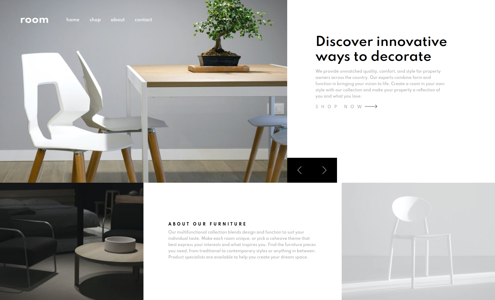
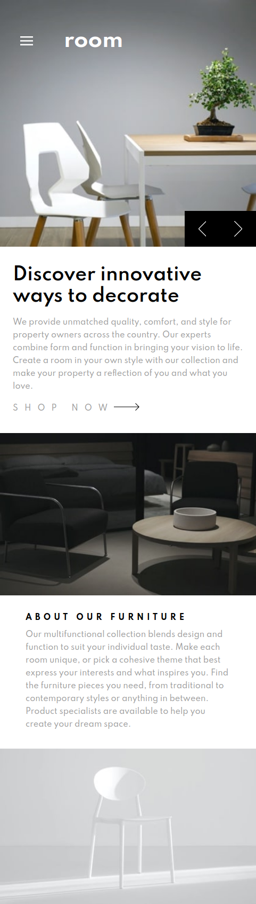

# Frontend Mentor - Room homepage

## Table of contents

- [Overview](#overview)
  - [The challenge](#the-challenge)
  - [Screenshot](#screenshot)
  - [Links](#links)
- [My process](#my-process)
  - [Built with](#built-with)
  - [What I learned](#what-i-learned)
- [Author](#author)

## Overview

### The challenge

Your challenge is to build out this e-commerce homepage and get it looking as close to the design as possible.

You can use any tools you like to help you complete the challenge. So if you've got something you'd like to practice, feel free to give it a go.

Your users should be able to:

- View the optimal layout for the site depending on their device's screen size
- See hover states for all interactive elements on the page
- Navigate the slider using either their mouse/trackpad or keyboard

### Screenshot

### Links

- [Solution](https://www.frontendmentor.io/solutions/react-with-styledcomponents-jVZGsVHLS)
- [Live Site](https://frontendmentorchallenge-roomhomepage.vercel.app/)

## My process

### Built with

- Semantic HTML5 markup
- CSS - Flexbox
- Mobile-first workflow
- [React](https://reactjs.org/) - JS library
- [Styled Components](https://styled-components.com/) - For styles
- [Figma](https://www.figma.com/) - For checking the design

### What I learned

- In this challenge I have learned to combine useEffect with an event listener to track the size of the window and to conditional render the appropiate components.

## Author

- Website - [Jorge Flagel](jorgeflagel.vercel.app/)
- Frontend Mentor - [@Jorge Flagel](https://www.frontendmentor.io/profile/jorgeflagel/solutions)
- LinkedIn - [@Jorge E. Flagel](https://www.linkedin.com/in/jorge-e-flagel-b2b372207/)

